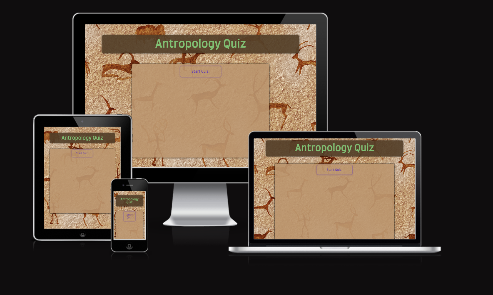
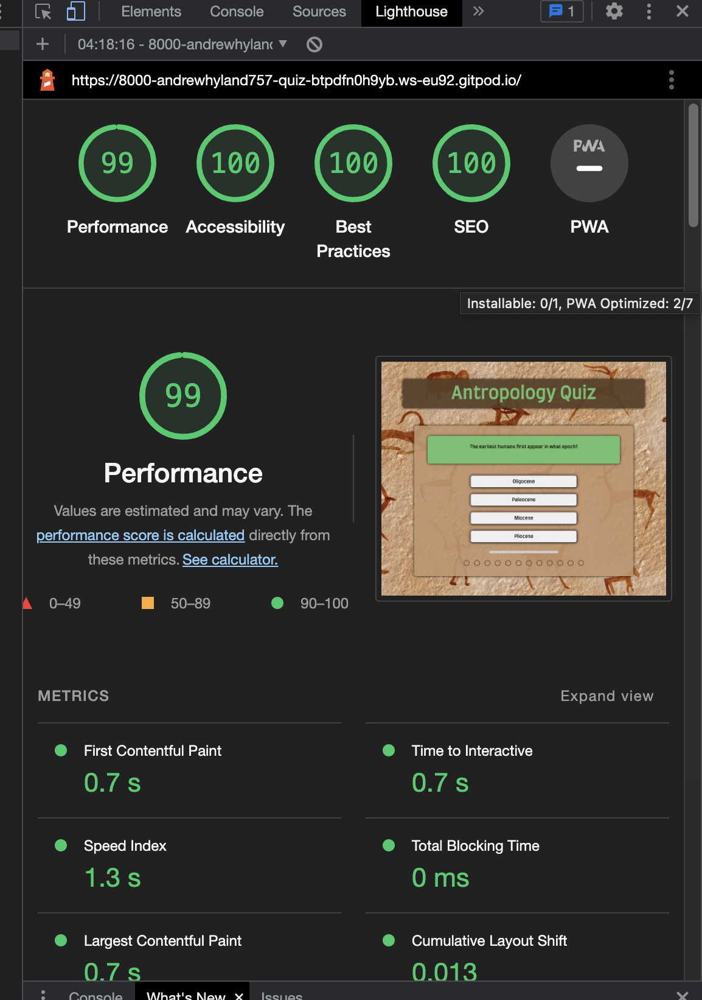

# Antropology Quiz

Antropology Quiz is a site for a unique, fun, and entertaining multiple choice quiz involving the subject matter of antropology.  
It was created as a portfolio project for Code Institute’s full-stack web development course curriculum and utilises HTML5, CSS3 and JavaScript.

## Features

### Start Button

* Situated at the top of the game area, this provides the user with a clear and easily identifiable way to start the game.

### Game layout and design

* The background image of cave paintings is in line with the topic of the quiz as well as providing a warm colour without being distracting.
* The green, brown, and purple colours used throughout the website were specifically matched to the background.
* The game area consists of a question container at the top in a green background.
* This is followed by the four answer choices the player is presented with.
* Under the options is a time bar, which gives the user twenty seconds to answer the question.
* Finally, we have the progress tracker, where each circle indicates a question and lights up when the question is answered. Green for correct and red for incorrect.
* The user's score is shown at the end of the twelve questions.

## Testing

* The site has been tested on Google Chrome, Safari, and Firefox.
* It is responsive and works on all standard screen sizes.

## Validator Testing

* HTML no errors found using the official W3C validator.
* CSS no were found using the Jigsaw validator.
* The Javascript code has been tested successfully, aside from a few warnings for undefined and unused variables. This was done on the JSHint website.

## Accessibility

I have tested the site on Lighthouse, and the results show the level of accessibility is excellent on all fronts.

## Unfixed Bugs
None

## Deployment
The site was deployed to GitHub pages. The steps to deployment are as follows:
In the GitHub repository, navigate to the Settings tab.
From the source section drop-down menu, select the Master Branch
Once the master branch has been selected, the page will be automatically refreshed with a detailed ribbon display to indicate the successful deployment.
The live link can be found here - https://andrewhyland757.github.io/Anthropology-Quiz2/
## Credits

Before I developed the website I watched the following tutorial "Create a Multiple Choice Quiz App Using JavaScript"  by Code Explained on YouTube.
It was a great help in understanding the logic behind such a quiz and it especially inspired the time bar feature on my own.
The background image is from Shutterstock.